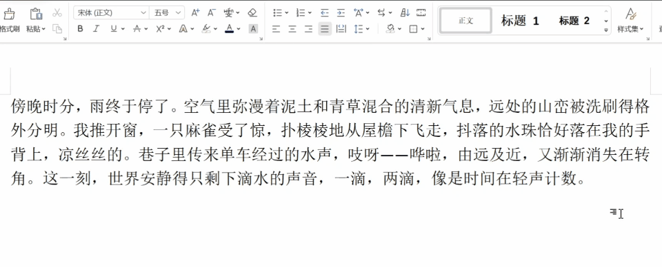
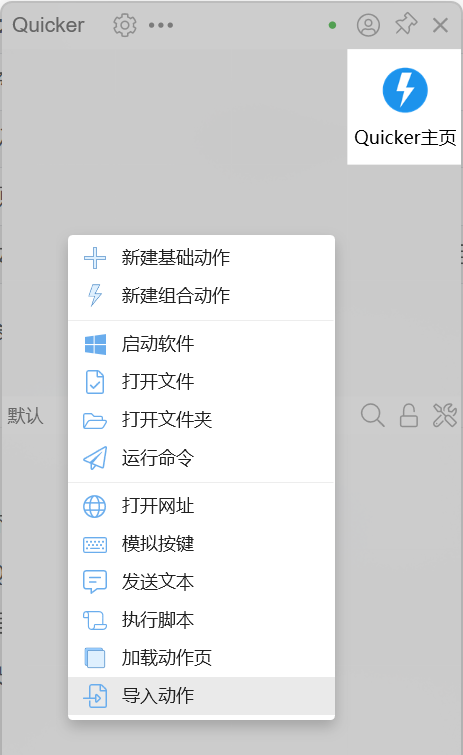
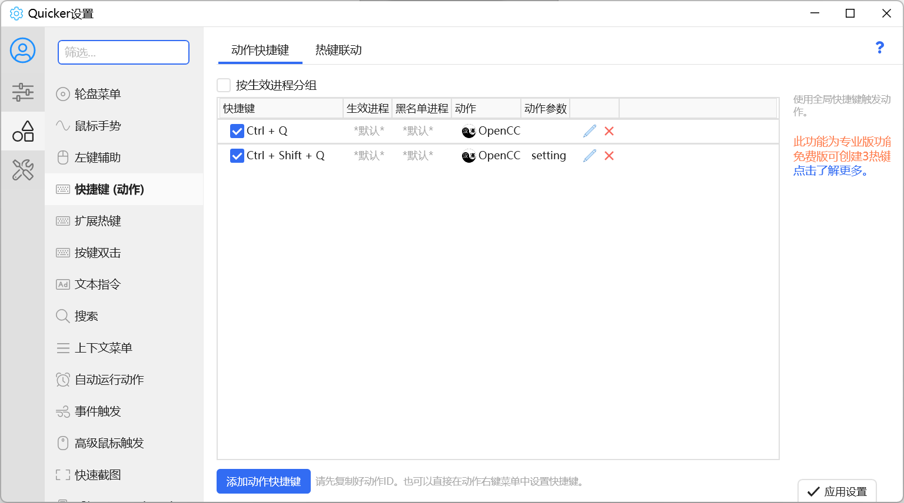

# 繁简快捷键转换

本项目是基于 [OpenCC（Quicker 动作）](https://getquicker.net/Sharedaction?code=57abc8f6-d63b-4f56-5f06-08d8c4779bc6) 改进的 Quicker 组合动作，在保留原有 OpenCC 转换能力的同时，针对**快捷键一键转换**场景做了增强。

## 亮点（改进方向）

#### ✅无需选中，直接转换

原版需要先选中文字再转换——写邮件、回消息、记笔记时，这一步往往最打断节奏。

本动作在**没有选中文字**时会自动执行 `Ctrl + A` 选中当前输入框的全部内容，再交给 OpenCC 处理。配合 Quicker 全局快捷键，流程变成：

> 输入 → 按快捷键 → 完成

不必伸手去选字，也不必切回鼠标。

因此，本动作支持三种转换方式：

- 输入汉字，直接按快捷键转换。
- 选中文本，按快捷键转换。
- 选中文件（可批量），按快捷键转换。

#### ✅保留剪贴板的上条内容

繁简转换通常会经过复制粘贴，很容易把你剪贴板里**上一条**还没粘贴的内容冲掉——比如刚复制的链接、待发的段落。

本动作会在转换开始前把剪贴板里的文本**暂存**，全部处理完后再**原样写回**。你可以放心开着「替换原文」模式高频使用，而不必每次转换前都先备份。

#### ✅安静完成，不弹进度条

原版会在屏幕右下角弹出「处理进度」窗口。对只想「改完继续写」的场景来说，这类提示有点显眼。

本改进版移除了进度窗，转换在后台走完。

## 原版功能介绍

#### ①支持14个转换方向

基于 OpenCC 官方配置，开箱即用：

| 配置文件 | 说明 |
|----------|------|
| `s2t.json` | 简体到繁体 |
| `t2s.json` | 繁体到简体 |
| `s2tw.json` | 简体到台湾正体 |
| `tw2s.json` | 台湾正体到简体 |
| `s2hk.json` | 简体到香港繁体 |
| `hk2s.json` | 香港繁体到简体 |
| `s2twp.json` | 简体到繁体（台湾正体标准）并转换为台湾常用词汇 |
| `tw2sp.json` | 繁体（台湾正体标准）到简体并转换为中国大陆常用词汇 |
| `t2tw.json` | 繁体（OpenCC 标准）到台湾正体 |
| `hk2t.json` | 香港繁体到繁体（OpenCC 标准） |
| `t2hk.json` | 繁体（OpenCC 标准）到香港繁体 |
| `t2jp.json` | 繁体（OpenCC 标准，旧字体）到日文新字体 |
| `jp2t.json` | 日文新字体到繁体（OpenCC 标准，旧字体） |
| `tw2t.json` | 台湾正体到繁体（OpenCC 标准） |

同时支持添加自定义配置。

#### ②支持4种输出方式

| 方式 | 适用场景 |
|------|----------------|
| **文本窗口** | 想先预览结果，再决定要不要采用 |
| **替换原文** | 在输入框里直接转换（**配合快捷键的最佳选择**） |
| **另存为文件** | 保留原文件，另存一份转换后的副本 |
| **另存为文件（静默）** | 批量处理时不想每次弹出保存对话框，自动在同目录生成 `_new` 文件 |

关于原版动作的详细介绍和教程可参照 [原版网址](https://getquicker.net/Sharedaction?code=57abc8f6-d63b-4f56-5f06-08d8c4779bc6)。

## 使用教程

1. 下载并安装 [Quicker](https://getquicker.net/Download)。

2. 下载 [OpenCC](https://github.com/BYVoid/OpenCC) 。OpenCC 可从原作者提供的 [蓝奏云](https://getquicker.net/Sharedaction?code=57abc8f6-d63b-4f56-5f06-08d8c4779bc6) 或 [GitHub Releases](https://github.com/BYVoid/OpenCC/releases) 获取。

   > **注意**：OpenCC 的 `build` 目录路径请勿包含中文。

3. 下载本仓库中的 `quick_converter.json`。

4. 按下鼠标中键或 ctrl 键，弹出 Quicker 面板。右键点击任一空白格，选择「导入动作」，并将 `quick_converter.json` 导入。

   

5. 将 OpenCC 下的 `build` 目录填写到初次运行弹出的输入框，即可开始使用。

6. （可选）右键点击动作图标，选择「选项设置」，将输出方式改为「替换原文」。

7. （可选，强烈建议）设置**转换快捷键**。点击进入 Quicker 面板的设置，选择「快捷键（动作）」，点击「添加动作快捷键」。以下快捷键以本人方案为例：

   - `Ctrl + Q` 作为转换快捷键。「动作 ID」填写 `OpenCC`。

   - `Ctrl + Shift + Q` 作为选项设置键（用于快捷设置转换方案）。「动作 ID」填写 `OpenCC`，「动作参数」填写 `setting`。

     

8. 在任一输入框里输入汉字。输入完成后按下 `Ctrl + Q` ，即可自动实现转换，轻松快捷。

   也可先选中文本或文件，再进行转换。

   > **注意**：本动作不能处理图片，故不要选中图片。

## 备注

1. 为宣传大陆繁体，谨在此列出大陆繁体的 OpenCC 项目。如需使用，可将其的 `.json` 和 `.ocd2` 文件粘贴到 `build/share/opencc` 下，并在「配置列表」中添加。

   | 配置文件     | 说明                                               | 仓库                                                         |
   | ------------ | -------------------------------------------------- | ------------------------------------------------------------ |
   | `s2tg.json`  | 简体到大陆标准繁体（《通用规范汉字表》）           | [Github](https://github.com/amorphobia/opencc-tonggui)       |
   | `t2gov.json` | 繁体到大陆标准繁体                                 | [Github](https://github.com/TerryTian-tech/OpenCC-Traditional-Chinese-characters-according-to-Chinese-government-standards) |
   | `s2g.json`   | 简体到古籍规范字形（《古籍印刷通用字规范字形表》） | [Github](https://github.com/forfudan/GujiCC)                 |
   | `g2s.json`   | 古籍规范字形到简体                                 | [Github](https://github.com/forfudan/GujiCC)                 |

2. 「无需选中，直接转换」的原理是模拟 `Ctrl + A` 选中输入框的所有内容。所以可能在某些输入框中存在适配问题。

3. 如有任何问题，可以提 issue 或直接联系我。谢谢！

## 项目由来

繁简混输一直存在着痛点。拼音输入法受困于「一简对多繁」；而五笔等形码虽有「打简出繁」功能，却依然无法完美处理一字多繁的情况。一个典型的例子是「么」字，在繁体中也会使用，但现有方案常将其强制转为「麼」。故本人查找并改进现有方案，以最大程度上减轻繁简输入上的隔离感。

## 致谢

本动作基于 Quicker 用户 [**咿呀杀杀**](https://getquicker.net/User/Actions/19337-咿呀杀杀) 分享的动作改进，核心转换能力由 [OpenCC](https://github.com/BYVoid/OpenCC) 提供。

感谢以上开源项目与贡献者！

> 原作者完成了 90% 的工作，本人仅做部分改进。故不准备将本动作发布到 Quicker 动作库。Quicker 上显示的「来源动作」仍是原项目的地址。
